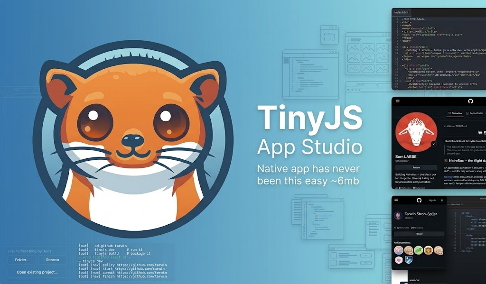
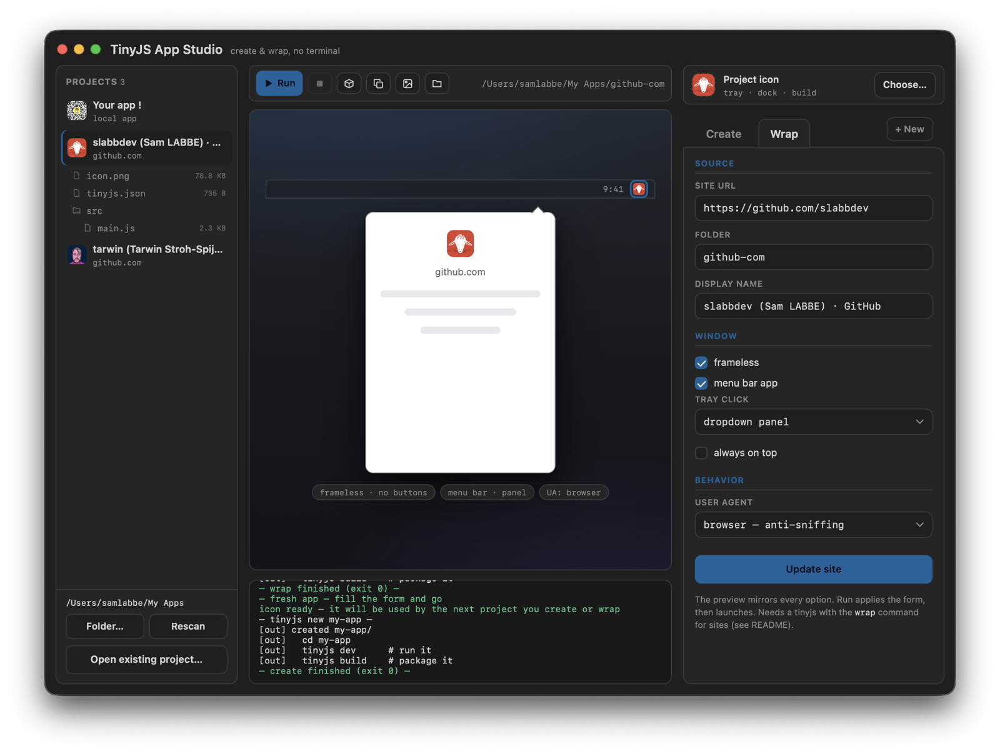
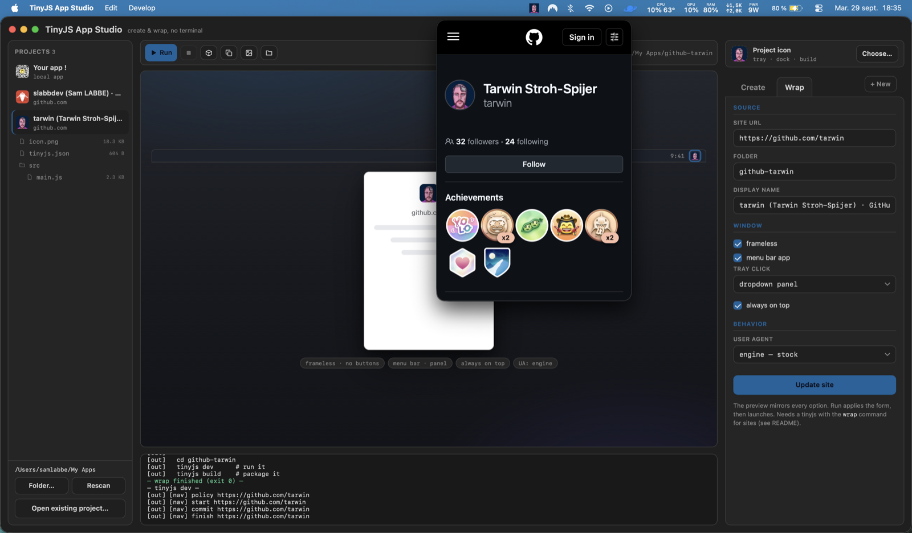
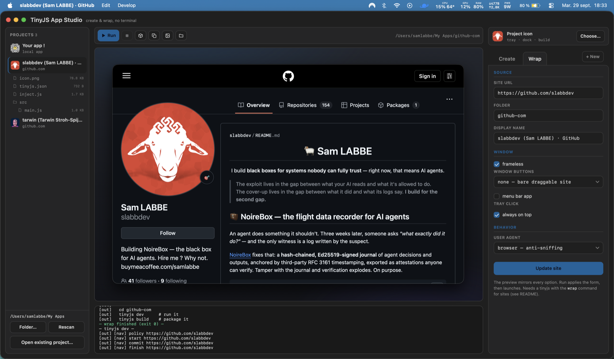
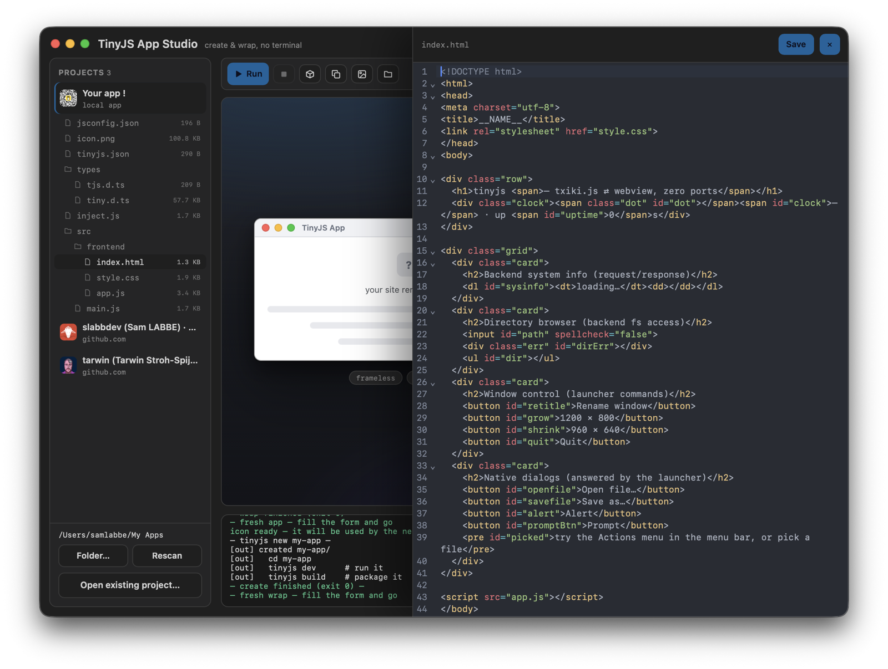
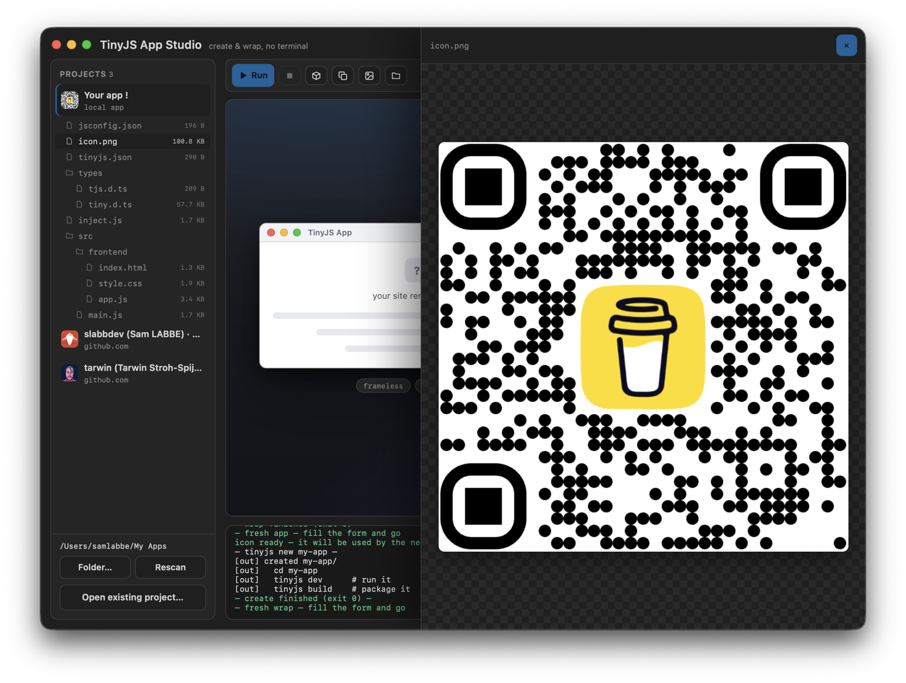
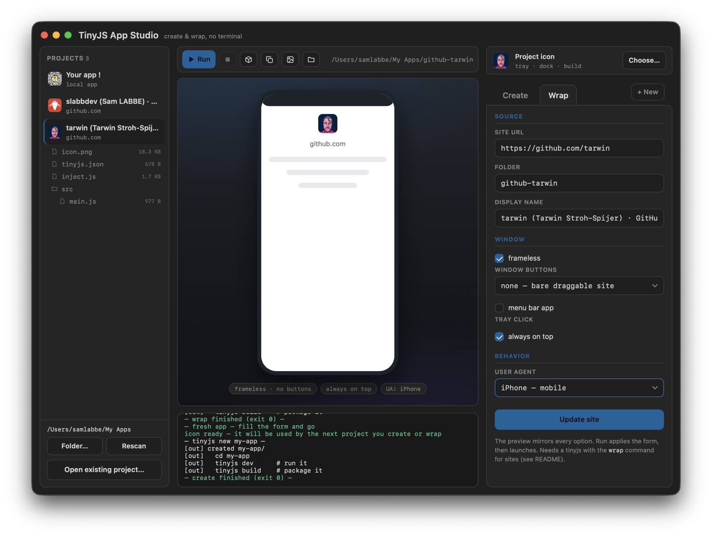

# TinyJS App Studio



**[🌐 Landing page](https://slabbdev.github.io/tinyjsapp-studio/)** — the screenshot tour, scroll by scroll.

A tiny desktop companion for [tinyjs](https://github.com/tarwin/tinyjsapp) —
create tinyjs apps and turn websites into desktop apps, without opening a
terminal. Built **with** tinyjs itself, which makes it the two things at once:

- **A living demo for developers.** Everything here is stock tinyjs — a native
  window, the bridge pushing streamed subprocess logs to the page, native
  folder pickers driving the UI, a JS backend with full process access in a
  few hundred lines. Read `src/` as the tutorial.
- **A gentle on-ramp for newcomers.** Pick a folder, name your app, click
  *Create*, watch the logs, hit *Run*. No shell required. The *Wrap* tab
  turns any website into a real desktop app the same way.

Built by [@slabbdev](https://github.com/slabbdev). Not an official tinyjs
project — just what its author considers the demo tinyjs deserved. 🙂

## See it

**Wrap any site.** Paste a URL, pick your window modes, watch the preview
mirror every option — then generate a ~6 MB desktop app with its own icon,
per-origin API gate, downloads and popup handling.



**Menu-bar apps, live.** Menu-bar mode puts a tray icon in the system menu
bar — click it and a dropdown panel anchored under the icon opens the site
(tray click can also open a normal window):



**Real windows, really wrapped.** The generated apps are ordinary desktop
windows — frameless or not, with whatever chrome you configured:



## The workspace

**Everything in one place.** Projects sidebar (with a file tree per
project), live preview stage, config inspector — sections Site, Window,
Behavior, Permissions.

**The file offcanvas.** Click a file in a project's tree: images open as a
preview, code files open in an editor with line numbers, code folding and
syntax highlighting (CodeMirror 6, vendored) — edit and save right there.





**iPhone mode.** The iPhone user-agent preset also reshapes the preview
into a phone frame — you see the mobile layout before you wrap:



## What it does

- **Create an app** — runs `tinyjs new` for you: the zero-dependency vanilla
  templates, or a Vite + npm one (react/vue/svelte/solid/preact/lit/alpine,
  TypeScript).
- **Wrap a website** — runs `tinyjs wrap`: a site becomes a real desktop app
  (native window, downloads, popup handling) whose pages get **no** access to
  your machine beyond their own window and dialogs — that gate is tinyjs'
  per-origin API policy, not a Studio promise. The form drives it: unread
  badge selector, open-in-browser domains, permission posture.
- **Open an existing project** — point the Studio at any tinyjs project
  folder anywhere on disk; it joins the sidebar with all its actions, no
  files moved.
- **Run, build, stop, duplicate, reset, reveal** — drive `tinyjs dev` /
  `tinyjs build` on the selected project, with every line of the CLI
  streamed live into the window. *Duplicate* clones a wrap into a separate
  container (multi-account); *Reset data* wipes its cookies and site
  storage, paths guarded to the app's own.

## Security, published

The gate is a feature here, not a footnote. The **Permissions** section
picks the posture for a wrap — `wrapper` (recommended), `none`, or custom
chips over the real wire methods, with the generated `api` config previewed
as it will be written — and the **Gate** tab shows any project exactly what
its pages may call: per-origin keyholes, a one-glance trust summary, and
warnings for the runtime's sharp edges (an absent gate, an unknown preset,
camera/mic consent).

Because "is it secure?" deserves evidence, not adjectives:

- [docs/THREAT-MODEL.md](docs/THREAT-MODEL.md) — every guarantee linked to
  the tinyjs release that shipped it, and the open holes listed, not hidden.
- [test/adversarial/](test/adversarial/) — a hostile page attacking our own
  wraps, verified live: gate denials, subframe isolation, printToPDF zones
  (hole #36 was published open here, then its fix was proven from the
  outside), malformed-wire drops.
- [The security page](https://slabbdev.github.io/tinyjsapp-studio/security.html)
  tells it in user language.
- Found something? [SECURITY.md](SECURITY.md) — privately, please.

## Requirements

None, really. Open the app: it checks for the [tinyjs](https://tinyjs.app)
CLI, and if it's missing, one click runs the official installer with every
line streamed into the console (macOS / Linux / Windows; on Linux the
installer explains the WebKitGTK runtime if it's missing). The Studio drives
the installed CLI by absolute path — no PATH editing, nothing else touched.

- **wrap** shipped upstream in tinyjs v0.44.0. Older installs still report
  *not in this release yet* in the Wrap tab — Create / Run / Build carry on,
  and the status bar shows whether your tinyjs has wrap. The Studio is
  developed and adversarially tested against tinyjs v0.50.
- Developing on wrap? A tinyjsapp checkout is picked up automatically (see
  below) — or set `TINYJS_BIN`.

The Studio finds the CLI in this order:

1. `TINYJS_BIN` environment variable
2. a `tinyjsapp` source checkout next to this repo (`../tinyjsapp`,
   `../tinyjsapp-cli`)
3. the installed CLI (`~/.tinyjs/tinyjs`, `%LOCALAPPDATA%\tinyjs\tinyjs.cmd`,
   or `PATH`)

The resolved binary, version and wrap support show in the window's status
bar.

## Run it

```sh
git clone https://github.com/slabbdev/tinyjsapp-studio
cd tinyjsapp-studio
tinyjs dev
```

Ship it like any tinyjs app: `tinyjs build` packages the whole Studio in a
few megabytes (a signed `.app` on macOS, binaries on Windows/Linux). No
Electron in sight, because there is no bundled browser: tinyjs renders with
the WebKit (or WebView2) your OS already has.

## Credits

- [tinyjs](https://github.com/tarwin/tinyjsapp) by
  [Tarwin Stroh-Spijer](https://github.com/tarwin) — the tool, the runtime,
  and the `wrap` plumbing this Studio drives. Docs at [tinyjs.app](https://tinyjs.app).
- The `wrap` command this Studio drove as a proposal shipped upstream in
  tinyjs v0.44.0 ([#20](https://github.com/tarwin/tinyjsapp/issues/20)) —
  this repo consumes it, it does not reimplement it.

## Support

If the Studio saves you a click, a coffee is appreciated ☕

<a href="https://buymeacoffee.com/samlabbe"></a>

## License

[MIT](LICENSE)
